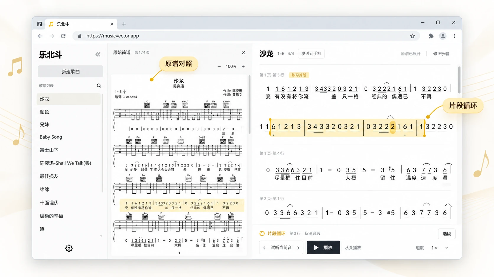
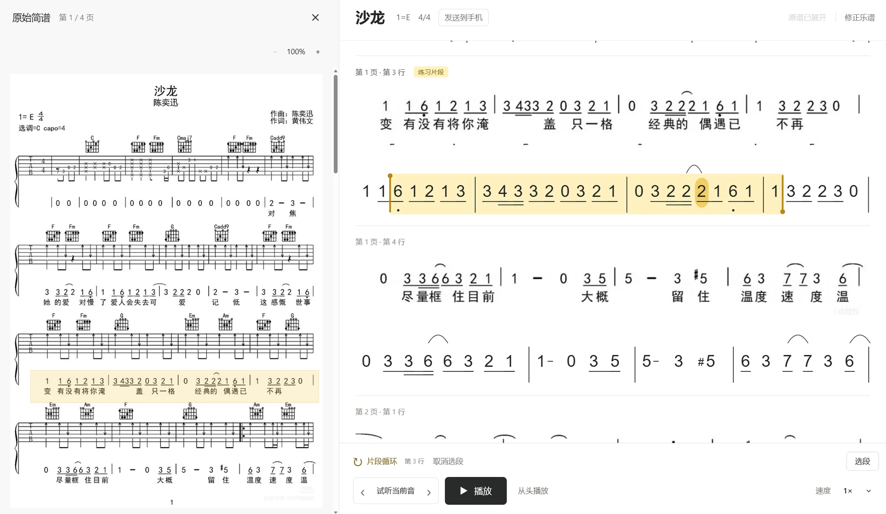
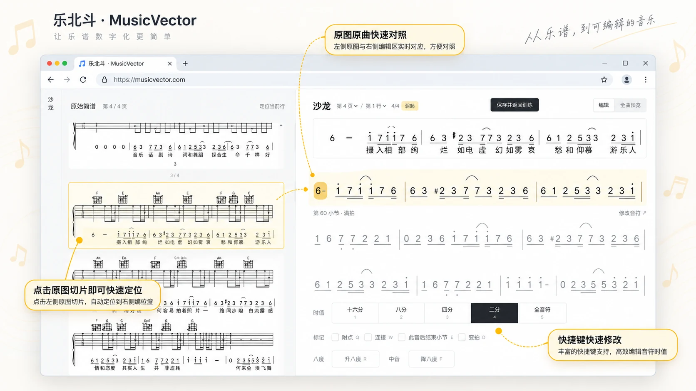
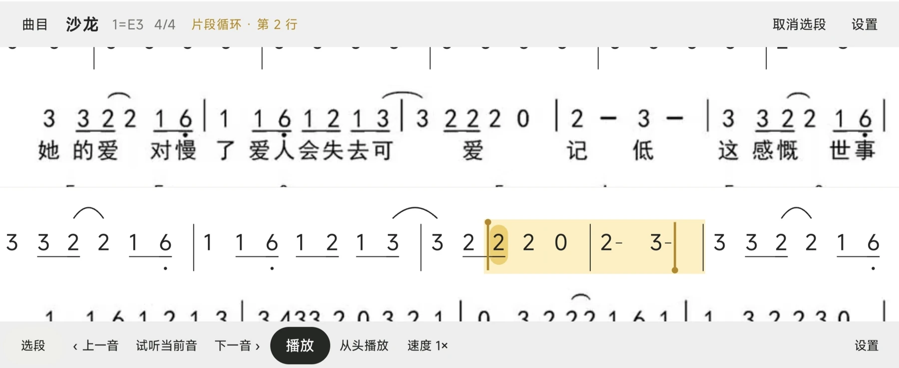

[English](README.md) | 中文

# 乐北斗 MusicVector

**把乐谱照片变成可以逐音跟练的练习曲。**

`MIT` · `Windows x64` · `Android 8.0+` · 曲库留在本机 · 无需账号

<p align="center">
  
</p>

拍下简谱照片传进来，程序认出错音高和节奏，再用真实钢琴音色按准确时值演奏。你可以只听某一段、反复循环那一小段、放慢速度，跟着它练音准。

曲库、原图和练习进度都留在你自己的电脑上，不需要注册账号。

## 屏幕上有什么

<p align="center">
  
</p>

练一首曲子只用这一个页面，左右两栏是同一首曲子的两种样子：

| 屏幕上的部分 | 是什么 |
|---|---|
| **左栏** | 你拍的那张乐谱原图，可以放大缩小，随时和右边对照 |
| **右栏** | 识别出的简谱。认错的地方一眼就能看出来，点「修正乐谱」改完保存 |
| **金色块** | 当前选中的片段，两端的金色手柄可以拖动改范围 |
| **底栏** | 播放、从头播放、当前音试听、速度 |

## 认错的地方，自己改

<p align="center">
  
</p>

识别不可能百分之百准确，所以「改得动」和「认得准」一样重要。**修正乐谱** 是一套键盘优先的编辑器：

- **左边原图、右边编辑区实时对应。** 哪一行认错了，点左边原图上对应的那一块，右边自动跳过去，不用自己翻。
- **改音高**：用「修改本行音符」直接改这一行的简谱文本，低音 `.1`、高音 `1'`、小节线 `|`。
- **改时值**：十六分到全音符五个按钮，也可以直接按数字键 `1`–`5`。
- **改标记**：附点 `Q`、连接 `W`、此音后结束小节 `E`、变拍 `D`；升八度 `R`、降八度 `F`。
- **改完先听一遍**：切到 **全曲预览** 试听整首，确认没问题再点 **保存并返回训练**，立刻就能按改好的谱子跟练。

## 下载与第一次运行

到本仓库的 **Releases** 页面下载需要的文件：

| 文件 | 用途 |
|---|---|
| `MusicVector-1.0-windows-x64.zip` | 电脑端（Windows 64 位） |
| `MusicVector-1.0-android.apk` | 手机端（安卓 8.0 及以上） |

电脑端不需要另外安装任何运行环境，压缩包里已经带好了。请解压到任意**可以写入**的目录（例如 `D:\乐北斗`），不要直接在压缩包里运行。

1. 在该文件夹里打开命令行（在地址栏输入 `powershell` 回车即可），运行：

   ```powershell
   .\runtime\node\node.exe .\app\launch.cjs
   ```

   浏览器会自动打开乐北斗，服务在后台运行，命令行窗口随即可以关闭。以后重复运行这条命令，只会打开已经开着的那个程序。（用 cmd 的话，去掉路径前面的 `.\`。）

2. 点 **新建歌曲**，上传乐谱照片：一页一张，可以多页。只收图片（PNG / JPEG / WebP），PDF 请先转成图片。
3. 到 **设置** 里填一次模型密钥并验证。**建议选通义千问 Qwen**，理由见下方常见问题。识别这一步需要联网调用视觉模型；密钥用 Windows 当前用户加密后只存在本机，换电脑需要重新填。
4. 点 **开始识别**。程序把每一页切成谱行逐行识别，结果先保存再返回，中途关电脑也不会丢已经认完的部分。
5. 识别不可能百分之百准确，看到不对的地方用 **修正乐谱** 改好并保存。
6. 回到训练页，点任意一个音就从那里开始练。

用完想结束时，在同一目录运行：

```powershell
.\runtime\node\node.exe .\app\server\server.mjs --home . --stop
```

关闭浏览器**不会**停止后台服务。

## 练习时能做什么

- **点任意一个音**就从那里开始播放；**框选一段**可以只反复练这一段。
- **演奏速度**有五档预设 0.5× / 0.75× / 0.9× / 1× / 1.1×，也能细调到 0.25×–1.25×。
- **每个音的长度正好等于它自己的时值**：八分音符就是四分音符的一半，听到的长短就是谱面上的长短，跟练时节奏不会被拖尾压歪。
- **当前音可以单独试听**，会把这一个音完整响完，适合对音准。
- 原图可以缩放，方便和识别结果逐行对照。

## 在手机上练

手机端只做三件事：扫码收曲目、打开已收曲目、删掉不要的。它没有编辑功能，改谱仍然在电脑上做。

<p align="center">
  
</p>

1. 手机和电脑连**同一个 Wi-Fi**。
2. 把 `Android/MusicVector.apk` 传到手机上安装。
3. 电脑上打开一首曲子，点拍号右边的 **发送到手机**，屏幕上会出现二维码。
4. 用手机端里的扫码功能扫这个二维码，曲目就传到手机上了，之后不带电脑也能练。

几点要注意：

- 二维码**十分钟内有效**，关掉发送面板就作废。同一网络下的其他人看不到你的曲库和密钥，只有这一个临时曲目能被取走。
- 连不上时，先确认手机和电脑是不是同一个网络；Windows 防火墙询问时选**允许专用网络**。
- 排查网络问题**不要用 ping 判断**：很多网络只挡 ping，实际传输是通的。

## 数据与备份

所有内容都在程序目录下的 `data` 文件夹里：

```text
data/
├── library.json          曲目索引
├── settings.json         设置
├── practice.json         上次练到哪
└── songs/<曲目 ID>/
    ├── song.json         曲目：音符、节奏、调号
    ├── images/           原图
    └── recognition/      识别过程记录
```

- **备份**：停止程序后，把整个 `data` 文件夹复制到安全位置，就是完整备份。
- **换电脑**：把整个乐北斗文件夹复制过去即可，模型密钥需要重新填一次。
- **恢复**：先另存当前的 `data`，再用完整备份整体替换；不要把不同备份里的单个文件混着用。
- **清空重来**：停止程序后删掉 `data` 文件夹，下次启动就是全新的空曲库。
- 程序意外中断时，未完成的保存会在下次启动时自动恢复。

## 常见问题

**没有声音？** 先看浏览器和系统音量；第一次播放要加载钢琴音色，稍等一两秒。

**识别失败、没有输出？** 识别需要联网。确认密钥已通过验证、网络可用。程序不会自动重试；失败时会保留模型的原始返回，便于排查原因。

**识别结果整体不对？** 换一张更清楚的原图：正对、光线均匀、不倾斜、不反光。识别质量主要取决于照片质量。

**端口被占用？** 程序会自动换一个可用端口，以本次弹出的浏览器地址为准。重复运行启动命令只会打开已经开着的那个实例。

**断网还能用吗？** 练习、播放和手机传输都可以（手机与电脑在同一 Wi-Fi 内）；只有识别需要联网。

**用哪个模型好？** 建议选 **通义千问（Qwen）**：识别提示词、切片方式和并发策略都是按 Qwen 实测调校出来的，是目前真正验证过的一套组合。设置里另有 Kimi、智谱 GLM、DeepSeek 可选，接口地址可改，也支持其它兼容 OpenAI 格式的服务——只是没有做过同等程度的验证。

## 许可与致谢

- 本项目以 [MIT 许可证](LICENSE) 发布。
- 内置钢琴音色来自 Salamander Grand Piano V3，采用 CC BY 3.0 许可。
- 随包运行环境与各开源库的来源和许可，见 `THIRD_PARTY_NOTICES.md`。

## 文档

每份文档都有中文和英文两个版本。

| 文档 | 中文 | English |
|---|---|---|
| 本 README | 本文件 | [README.md](README.md) |
| 使用说明（随下载包一起提供） | [USER-GUIDE.zh-CN.md](USER-GUIDE.zh-CN.md) | [USER-GUIDE.md](USER-GUIDE.md) |
| 开发说明 | [DEVELOPMENT.md](DEVELOPMENT.md) | [DEVELOPMENT.en.md](DEVELOPMENT.en.md) |
| 识别规范（提示词与符号） | [AI-RECOGNITION-SOP.md](AI-RECOGNITION-SOP.md) | [AI-RECOGNITION-SOP.en.md](AI-RECOGNITION-SOP.en.md) |
| 安卓端说明 | [android/README.md](android/README.md) | [android/README.en.md](android/README.en.md) |
| 谱面切片流程 | [python/SCORE-SLICING.md](python/SCORE-SLICING.md) | [python/SCORE-SLICING.en.md](python/SCORE-SLICING.en.md) |
| 符号基线 | [python/SYMBOL-BASELINE.md](python/SYMBOL-BASELINE.md) | [python/SYMBOL-BASELINE.en.md](python/SYMBOL-BASELINE.en.md) |
| 第三方说明 | [THIRD_PARTY_NOTICES.md](THIRD_PARTY_NOTICES.md) | [THIRD_PARTY_NOTICES.en.md](THIRD_PARTY_NOTICES.en.md) |
